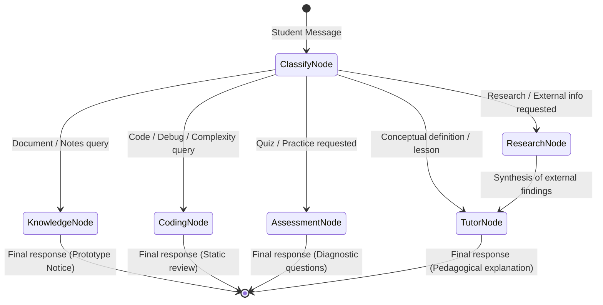

# Agent Design & Orchestration Workflow

Athena is structured around a centralized orchestrator and five specialized task agents orchestrated via **LangGraph**.

---

## State Schema (`AthenaState`)

All agents communicate across typed boundaries through `AthenaState` (`backend/app/agents/state.py`):

```python
class AthenaState(TypedDict, total=False):
    user_id: str
    session_id: str
    current_request: str
    current_topic: str
    learning_level: str          # "beginner" | "intermediate" | "advanced"
    explanation_depth: str       # "short" | "standard" | "detailed"
    learning_goal: Optional[str]
    conversation_messages: List[Dict[str, Any]]
    relevant_memory: Dict[str, Any]
    requested_agents: List[str]
    active_agent: str
    retrieved_documents: List[Dict[str, Any]]
    web_sources: List[Dict[str, Any]]
    research_findings: Optional[str]
    tutor_output: Optional[str]
    coding_output: Optional[Dict[str, Any]]
    assessment_output: Optional[Dict[str, Any]]
    final_response: str
    workflow_status: str
    tool_errors: List[str]
    approval_status: Optional[str]
```

---

## Conditional Routing State Graph



---

## Detailed Agent Roles & Specifications

### 1. Orchestrator Agent
- **File**: `backend/app/agents/orchestrator.py`
- **Responsibility**: Analyzes inquiry intent, extracts key CS topic, evaluates inline mathematical calculations safely, branches conditionally via `router_condition`, and checkpoint-saves workflow state using `MemorySaver`.

### 2. Research Agent
- **File**: `backend/app/agents/research_agent.py`
- **Responsibility**: Queries external web search, sanitizes incoming web snippets from prompt injection phrases (e.g. "ignore previous instructions"), extracts authentic source titles and domains, and produces structured citations. Never hallucinates sources.

### 3. Tutor Agent
- **File**: `backend/app/agents/tutor_agent.py`
- **Responsibility**: Translates technical principles into pedagogical content adapted to the student's learning profile:
  - **Beginner**: Intuition, relatable analogies, foundational terminology.
  - **Intermediate**: Practical engineering mechanics, formal CS semantics, standard algorithm trade-offs.
  - **Advanced**: Formal mathematical proofs, hardware and low-level implications, asymptotic bounds, micro-optimizations.
  - **Depth Control**: Strict conformance to Short (2-3 sentences), Standard (explanation + code/diagram), or Detailed (comprehensive logic, steps, edge cases).

### 4. Coding Agent
- **File**: `backend/app/agents/coding_agent.py`
- **Responsibility**: Static code evaluation, bug identification, algorithmic complexity analysis ($O(1), O(n), O(n^2), O(\log n)$).
- **Safety Directive**: Code execution is strictly isolated from the backend process. Unsafe system imports (`os`, `subprocess`, `shutil`) are flagged and code is never run arbitrarily on the host machine.

### 5. Assessment Agent
- **File**: `backend/app/agents/assessment_agent.py`
- **Responsibility**: Generates diagnostic multiple-choice and conceptual evaluation questions. Evaluates student submissions, calculates scores, provides constructive explanations, and extracts knowledge gaps for targeted revision. Never reveals correct answers before submission.

### 6. Knowledge Agent
- **File**: `backend/app/agents/knowledge_agent.py`
- **Responsibility**: In accordance with the project specification for the RAG UI Prototype, transparently communicates that document ingestion is a frontend interface demonstration. Refuses to fabricate document excerpts or invent fake citations.
