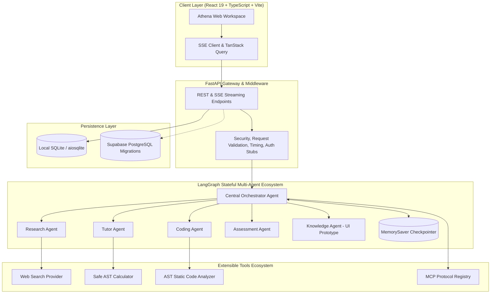

# System Architecture - Athena AI/CS Study Assistant

Athena is designed as a modular, production-ready, multi-agent learning platform centered around a stateful LangGraph orchestrator, an asynchronous FastAPI backend, and a modern React 19 / Tailwind CSS frontend.

---

## High-Level Topology

---

## Component Boundaries

### 1. Central Orchestrator (`app/agents/orchestrator.py`)
- Employs a compiled LangGraph `StateGraph(AthenaState)` with `MemorySaver` thread checkpointing.
- Analyzes incoming inquiries and conditionally branches to specialized agents without brute-forcing every specialist.
- Implements resilient fallbacks and coordinates tool execution results.

### 2. Specialized Agents
- **Tutor Agent (`app/agents/tutor_agent.py`)**: Generates adaptive, pedagogically grounded explanations across Beginner, Intermediate, and Advanced tiers, adhering to Short, Standard, or Detailed explanation depths.
- **Research Agent (`app/agents/research_agent.py`)**: Interacts with the search tool layer, extracts and sanitizes source metadata, and filters out prompt injection attacks.
- **Coding Agent (`app/agents/coding_agent.py`)**: Performs static AST analysis, complexity heuristic checks, and code debugging guidance. Crucially, **never executes untrusted code on the host environment**.
- **Assessment Agent (`app/agents/assessment_agent.py`)**: Generates structured multiple-choice and conceptual practice questions, evaluates submitted answers, computes scores, and maps out student knowledge gaps.
- **Knowledge Agent (`app/agents/knowledge_agent.py`)**: UI Prototype agent adhering strictly to project guidelines; clearly informs users that backend document answering is in prototype phase rather than hallucinating citations.

### 3. Safe Tool Architecture
- **Calculator**: Evaluates expressions using a pure AST visitor with a safe mathematical operator and function whitelist, completely avoiding vulnerable `eval()` execution.
- **Code Analyzer**: Parses code using Python's `ast` parser, calculates loop nesting depth and recursion for Big-O complexity estimation, and checks against sensitive standard library imports (`os`, `subprocess`).
- **MCP Client**: Abstraction implementing the Model Context Protocol concept, registering servers, exposing tools, enforcing explicit authorization, and guarding executions with strict timeouts.

### 4. Storage & Session Isolation
- Out-of-the-box local development functions using SQLite with `aiosqlite` and SQLAlchemy.
- Full row-level-security (RLS) PostgreSQL DDL provided in `docs/database_schema.md` for zero-friction Supabase cloud deployment.
- Strict session ownership checks guarantee that no student can inspect another learner's history.
