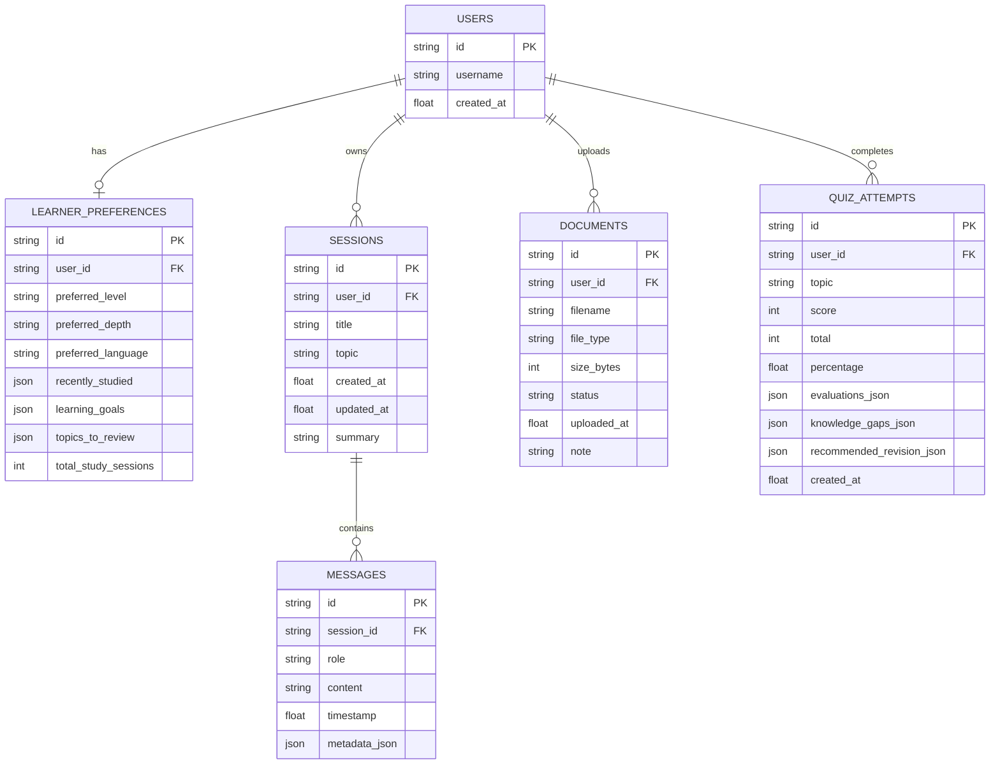

# Database Schema & Persistence Architecture

Athena uses a dual-tier persistence design:
1. **Local Development**: Out-of-the-box zero-cloud SQLite using `aiosqlite` and SQLAlchemy.
2. **Cloud Production**: Supabase PostgreSQL schema with Row-Level Security (RLS) policies.

---

## Entity-Relationship Diagram



---

## Supabase PostgreSQL Production DDL & Migrations

Execute the following script in the Supabase SQL Editor:

```sql
-- 1. Users Table
CREATE TABLE IF NOT EXISTS public.users (
    id VARCHAR(64) PRIMARY KEY,
    username VARCHAR(64) NOT NULL DEFAULT 'learner',
    created_at DOUBLE PRECISION DEFAULT EXTRACT(EPOCH FROM NOW())
);

-- 2. Learner Preferences Table
CREATE TABLE IF NOT EXISTS public.learner_preferences (
    id VARCHAR(64) PRIMARY KEY,
    user_id VARCHAR(64) UNIQUE REFERENCES public.users(id) ON DELETE CASCADE,
    preferred_level VARCHAR(32) DEFAULT 'intermediate',
    preferred_depth VARCHAR(32) DEFAULT 'standard',
    preferred_language VARCHAR(32) DEFAULT 'English',
    recently_studied JSONB DEFAULT '[]'::jsonb,
    learning_goals JSONB DEFAULT '[]'::jsonb,
    topics_to_review JSONB DEFAULT '[]'::jsonb,
    total_study_sessions INT DEFAULT 0
);

-- 3. Sessions Table
CREATE TABLE IF NOT EXISTS public.sessions (
    id VARCHAR(64) PRIMARY KEY,
    user_id VARCHAR(64) REFERENCES public.users(id) ON DELETE CASCADE,
    title VARCHAR(255) DEFAULT 'New Learning Session',
    topic VARCHAR(255) DEFAULT 'Computer Science',
    created_at DOUBLE PRECISION DEFAULT EXTRACT(EPOCH FROM NOW()),
    updated_at DOUBLE PRECISION DEFAULT EXTRACT(EPOCH FROM NOW()),
    summary TEXT
);

-- 4. Messages Table
CREATE TABLE IF NOT EXISTS public.messages (
    id VARCHAR(64) PRIMARY KEY,
    session_id VARCHAR(64) REFERENCES public.sessions(id) ON DELETE CASCADE,
    role VARCHAR(32) NOT NULL,
    content TEXT NOT NULL,
    timestamp DOUBLE PRECISION DEFAULT EXTRACT(EPOCH FROM NOW()),
    metadata_json JSONB DEFAULT '{}'::jsonb
);

-- 5. Documents Table (UI Prototype metadata)
CREATE TABLE IF NOT EXISTS public.documents (
    id VARCHAR(64) PRIMARY KEY,
    user_id VARCHAR(64) REFERENCES public.users(id) ON DELETE CASCADE,
    filename VARCHAR(255) NOT NULL,
    file_type VARCHAR(64) NOT NULL,
    size_bytes INT NOT NULL,
    status VARCHAR(32) DEFAULT 'Ready',
    uploaded_at DOUBLE PRECISION DEFAULT EXTRACT(EPOCH FROM NOW()),
    note VARCHAR(255) DEFAULT 'RAG UI prototype — backend indexing not implemented'
);

-- 6. Quiz Attempts Table
CREATE TABLE IF NOT EXISTS public.quiz_attempts (
    id VARCHAR(64) PRIMARY KEY,
    user_id VARCHAR(64) REFERENCES public.users(id) ON DELETE CASCADE,
    topic VARCHAR(255) NOT NULL,
    score INT NOT NULL,
    total INT NOT NULL,
    percentage DOUBLE PRECISION NOT NULL,
    evaluations_json JSONB DEFAULT '[]'::jsonb,
    knowledge_gaps_json JSONB DEFAULT '[]'::jsonb,
    recommended_revision_json JSONB DEFAULT '[]'::jsonb,
    created_at DOUBLE PRECISION DEFAULT EXTRACT(EPOCH FROM NOW())
);

-- Row-Level Security (RLS) Policies
ALTER TABLE public.users ENABLE ROW LEVEL SECURITY;
ALTER TABLE public.learner_preferences ENABLE ROW LEVEL SECURITY;
ALTER TABLE public.sessions ENABLE ROW LEVEL SECURITY;
ALTER TABLE public.messages ENABLE ROW LEVEL SECURITY;
ALTER TABLE public.documents ENABLE ROW LEVEL SECURITY;
ALTER TABLE public.quiz_attempts ENABLE ROW LEVEL SECURITY;

-- Owner isolation policy
CREATE POLICY "Users can only view and update own profile" ON public.users
    FOR ALL USING (auth.uid()::text = id);

CREATE POLICY "Users can only access own sessions" ON public.sessions
    FOR ALL USING (auth.uid()::text = user_id);

CREATE POLICY "Users can only access own documents" ON public.documents
    FOR ALL USING (auth.uid()::text = user_id);
```
