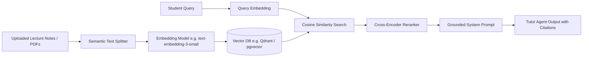

# RAG & Knowledge Base - UI Prototype Documentation

> [!IMPORTANT]
> **Status**: RAG UI prototype — backend not implemented.
> In accordance with the Athena Master Specification, RAG is included in Athena for product demonstration and interface design purposes only. No functional embedding models, chunking pipelines, or vector databases (e.g. Qdrant) are running on the backend.

---

## Purpose & Interface Architecture

Athena provides a full-fidelity **Study Materials** interface designed to demonstrate the user experience of an AI study environment grounded in student course materials.

### Implemented UI Features
1. **Interactive Document Manager**: Drag-and-drop document upload interface supporting `.pdf`, `.txt`, and `.md` formats with size validation (up to 15MB).
2. **Document Status Cards**: Visual representation of active study files with filename, file size, status badges, and deletion controls.
3. **Processing Progression Sequence**: Visual simulation of the ingestion workflow:
   $$\text{Uploaded} \longrightarrow \text{Processing} \longrightarrow \text{Ready}$$
4. **Transparent Integrity Notice**: Clear notification banner on the Knowledge Base workspace disclosing that vector retrieval is not yet connected.
5. **Knowledge Agent Guardrail**: When students submit queries asking about uploaded documents in chat, the Knowledge Agent explicitly explains that document-based answering is currently a UI prototype rather than hallucinating citations.

---

## Planned Future Vector Architecture (Roadmap)

When Athena transitions from the UI prototype to a live RAG pipeline, the following modular components can be integrated without redesigning the platform:

### Planned Technical Specifications
- **Parser**: Unstructured or PyPDF parsing with layout detection.
- **Chunking**: Recursive character text splitting (500-800 tokens with 10% overlap).
- **Vector Store**: Qdrant collection or Supabase `pgvector` with HNSW indexing.
- **Reranker**: Cohere or BGE cross-encoder for precision filtering.
- **Citations**: Page number, bounding box, and document title metadata attached to retrieved chunks.
